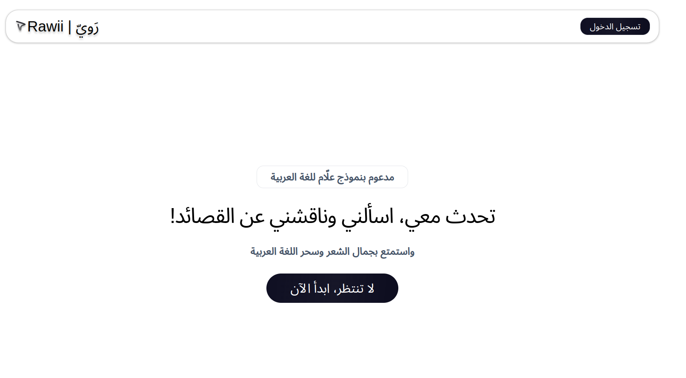

# Rawi Web Application

Built proudly using the Allam Larage Language Model. [Read more](https://arxiv.org/pdf/2407.15390). The dataset used is a collection of books for Arabic poems and their explanations by the famous author Aref Hijjawi.



## Repository Structure

```plaintext
- rawi-app/ --- Web application code
- Scripts/ ---  Data preparation scripts
- BenchMarks.xlsx --- Benchmark file used for testing
- demo_video.mp4 ---- Video for the demo of our solution
- Rawii.pptx --- Slides about the solution (please open it via google slides!)
```

## Tech Stack

- [IBM Watsonx](https://www.ibm.com/watsonx) for using Allam Model after being fine tuned
- [Next.js App Router](https://nextjs.org/docs/app) for the framework
- [LangChain.js](https://js.langchain.com/docs/get_started/introduction/) for the RAG code
- [MongoDB Atlas](https://www.mongodb.com/atlas/database) for the vector database
- [Bytescale](https://www.bytescale.com/) for PDF storage
- [Clerk](https://clerk.dev/) for user authentication
- [Tailwind CSS](https://tailwindcss.com/) for styling

## Deploy Your Own

You can deploy this template to Vercel or any other host. Note that you'll need to:

- Set up a [MongoDB Atlas](https://www.mongodb.com/atlas/database) database with 768 dimensions
    - See instructions below for MongoDB
- Set up [Bytescale](https://www.bytescale.com/)
- Set up [Clerk](https://clerk.dev/)
- Set up [Vercel](https://vercel.com/)
- Set up a fine tuned model on IBM Watsonx

See the `.example.env` for a list of all the required environment variables.

You will also need to prepare your database schema by running `npx prisma db push`.

### MongoDB Atlas

To set up a [MongoDB Atlas](https://www.mongodb.com/atlas/database) database as the backing vectorstore, you will need to perform the following steps:

1. Sign up on their website, then create a database cluster. Find it under the `Database` sidebar tab.
2. Create a **collection** by switching to the `Collections` tab and creating a blank collection.
3. Create an **index** by switching to the `Atlas Search` tab and clicking `Create Search Index`.
4. Make sure you select `Atlas Vector Search - JSON Editor`, select the appropriate database and collection, and paste the following into the textbox:

        ```json
        {
            "fields": [
                {
                    "numDimensions": 768,
                    "path": "embedding",
                    "similarity": "euclidean",
                    "type": "vector"
                },
                {
                    "path": "docstore_document_id",
                    "type": "filter"
                }
            ]
        }
        ```

        Note that the `numDimensions` is 768 to match the embeddings model we're using, and that we have another index on `docstore_document_id`. This allows us to filter later.

        You may call the index whatever you wish, just make a note of it!

5. Finally, retrieve and set the following environment variables:

        ```ini
        NEXT_PUBLIC_VECTORSTORE=mongodb # Set MongoDB Atlas as your vectorstore

        MONGODB_ATLAS_URI= # Connection string for your database.
        MONGODB_ATLAS_DB_NAME= # The name of your database.
        MONGODB_ATLAS_COLLECTION_NAME= # The name of your collection.
        MONGODB_ATLAS_INDEX_NAME= # The name of the index you just created.
        ```

## How to Run

1. Make sure that you supplied all the environment keys as in the `.example.env`.
2. Ensure Node.js v18 is installed.
3. Run `npm install`.
4. Ensure PostgreSQL is installed.
5. Make sure that the schema is pushed to PostgreSQL 16.4 using `npx prisma db push`.
6. Navigate to the main folder, and run `npm run dev`.

## Authors
@Abdullah-Sukkar, @DRMALEK

## License
MIT License
